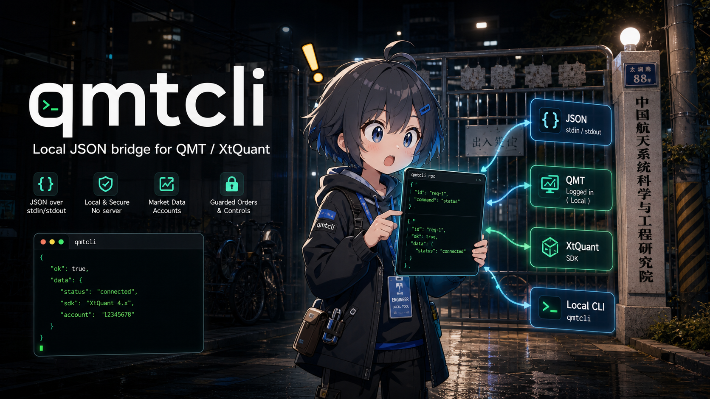

# qmtcli

[](https://github.com/2233admin/qmtcli/actions/workflows/test.yml)


English | [中文](README.zh-CN.md)

Local JSON CLI for QMT / miniQMT and the bundled XtQuant SDK.

`qmtcli` is a small bridge between a logged-in local QMT client and tools that prefer process I/O:
agents, scripts, schedulers, notebooks, or other automation. It exposes diagnostics, market data,
account queries, and guarded stock order commands over stable JSON stdin/stdout.



`qmtcli` does not install QMT, store credentials, bypass broker risk checks, or run a network
service. QMT must already be installed and logged in locally.

## Quick Demo

Discover the command surface:

```powershell
qmtcli capabilities
qmtcli schema
qmtcli examples
```

Run one JSON request:

```powershell
Get-Content examples\status.json | qmtcli rpc
```

Run a JSONL loop for an agent or script:

```powershell
qmtcli server
```

Response shape:

```json
{"ok":true,"data":{}}
```

Error shape:

```json
{"ok":false,"error":"message"}
```

If a request includes `id`, the response echoes it.

## Why

QMT bundles `xtquant` inside the broker client install. That is fine for direct Python scripts on a
trading machine, but awkward for agents and process-based automation. `qmtcli` keeps the QMT
integration local and gives callers a simple JSON contract:

- `capabilities`, `schema`, and `examples` for discovery;
- `rpc` for one request over stdin/stdout;
- `server` for newline-delimited JSON requests;
- explicit labels for read-only calls, escape hatches, order placement, and cancellation;
- tests that fake `xtquant`, so CI does not need a broker install.

Any runtime that can start a local process and exchange JSON can use it.

## Features

- QMT SDK discovery from common Windows install paths.
- `status` and `doctor` diagnostics.
- Market data commands: calendar, trading dates, sectors, ticks, bars, L2 data, instrument/ETF/CB/
  IPO/index-weight metadata, and financials.
- pandas-aware JSON output: DataFrames/Series returned by xtdata are serialized as records (a time
  index is kept as a plain column), and NaN/NaT/`pd.NA`/numpy scalars all become plain JSON values
  instead of invalid `NaN` tokens or unreadable object dumps.
- `download` command for populating the local QMT cache (history, financials, sectors, index
  weight, convertible bonds, ETF info, holidays, contracts).
- Account queries: asset, positions, orders, trades.
- Fixed-price A-share `buy`, `sell`, and `cancel`.
- Generic `data-call` for public `xtquant.xtdata` methods.
- Generic `trade-call` for public `XtQuantTrader` methods.
- Agent/script protocol commands: `capabilities`, `schema`, `examples`, `rpc`, `server`.

See [`docs/xtdata-alignment.md`](docs/xtdata-alignment.md) for the full function-to-command
coverage matrix against the official
[xtdata docs](https://dict.thinktrader.net/nativeApi/xtdata.html).

## Install

For local development:

```powershell
uv sync --extra dev
uv run qmtcli status
```

Editable pip install:

```powershell
pip install -e .[dev]
qmtcli status
```

## Agent And Script Usage

Discovery:

```powershell
qmtcli capabilities
qmtcli schema
qmtcli examples
```

One-shot RPC:

```powershell
Get-Content examples\status.json | qmtcli rpc
Get-Content examples\data_call.json | qmtcli rpc
```

JSONL loop:

```powershell
.\examples\jsonl_server.ps1
```

Generic integration notes are in [`examples/agent_tool.md`](examples/agent_tool.md). A short demo
recording script is in [`docs/demo_storyboard.md`](docs/demo_storyboard.md).

All named data commands (`calendar`, `bars`, `sector-stocks`, `download`, ...) are available over
`rpc`/`server` too, not just the CLI; send their CLI parameter names as JSON fields, for example
`{"command":"bars","symbols":["600519.SH"],"period":"1d"}`. The command name accepts either dashes
or underscores (`sector-stocks` or `sector_stocks`).

## Server Streaming

In `server` mode only, `subscribe`, `subscribe_whole`, and `unsubscribe` wrap the callback-based
`xtdata.subscribe_quote`, `subscribe_whole_quote`, and `unsubscribe_quote`:

```json
{"command":"subscribe","symbol":"600519.SH","period":"1d"}
{"command":"subscribe_whole","symbols":["600519.SH","000001.SZ"]}
{"command":"unsubscribe","seq":1}
```

Subscribing responds with `{"ok":true,"data":{"seq":1}}`, and every later quote push from xtquant
is printed as its own JSONL line carrying an `event` field instead of `ok`, interleaved with normal
responses on the same stdout stream:

```json
{"ok":true,"data":{"seq":1}}
{"event":"quote","seq":1,"symbol":"600519.SH","data":{"600519.SH":{"lastPrice":1500.0}}}
```

The one-shot `rpc` command and the CLI reject subscribe commands with `{"ok":false,"error":
"subscribe commands require server mode"}`, since a subscription only makes sense while `server`
keeps the process alive.

## QMT Paths

Pass either a QMT install root or its `userdata_mini` directory:

```powershell
qmtcli --path D:\DFZQxtqmt_client_real_win64 doctor
qmtcli --path D:\DFZQxtqmt_client_real_win64\userdata_mini --account ACCOUNT_ID asset
```

When `--path` is omitted, these roots are checked:

- `D:\DFZQxtqmt_client_real_win64`
- `D:\DFZQxtqmt_client_test_win64`
- `C:\DFZQxtqmt_client_real_win64`
- `C:\DFZQxtqmt_client_test_win64`

Expected SDK location:

```text
<QMT root>\bin.x64\Lib\site-packages\xtquant
```

## Common Commands

Diagnostics:

```powershell
qmtcli status
qmtcli doctor
python -m qmtcli status
```

Market data:

```powershell
qmtcli calendar SH
qmtcli trading-dates SH --count 5
qmtcli sector-list
qmtcli sector-stocks 沪深A股
qmtcli full-tick 600519.SH 000001.SZ
qmtcli bars 600519.SH --period 1d --count 100
qmtcli instrument-detail 600519.SH
qmtcli instrument-type 600519.SH
qmtcli divid-factors 600519.SH
qmtcli holidays
qmtcli period-list
qmtcli ipo-info
qmtcli cb-info 123001.SZ
qmtcli etf-info
qmtcli index-weight 000300.SH
qmtcli financials 600519.SH --tables Balance
```

L2 commands require Level-2 market data permission from the broker and are not covered by the
public xtdata doc page:

```powershell
qmtcli l2-quote 600519.SH
qmtcli l2-order 600519.SH
qmtcli l2-transaction 600519.SH
```

Download data into the local QMT cache; these calls return once the SDK download finishes and do
not print market data themselves — use the read commands above for that:

```powershell
qmtcli download history 600519.SH --period 1d
qmtcli download financials 600519.SH --tables Balance
qmtcli download sectors
qmtcli download index-weight
qmtcli download cb
qmtcli download etf
qmtcli download holidays
qmtcli download history-contracts
```

Account and order commands require `--account`:

```powershell
qmtcli --account ACCOUNT_ID asset
qmtcli --account ACCOUNT_ID positions
qmtcli --account ACCOUNT_ID orders
qmtcli --account ACCOUNT_ID trades
qmtcli --account ACCOUNT_ID buy 600519.SH 100 1500.00
qmtcli --account ACCOUNT_ID sell 600519.SH 100 1500.00
qmtcli --account ACCOUNT_ID cancel ORDER_ID
```

## Escape Hatches

`data-call` calls any public method on `xtquant.xtdata`:

```powershell
qmtcli data-call get_stock_list_in_sector --args "[\"沪深A股\"]"
qmtcli data-call get_cb_info --args "[\"123001.SZ\"]"
```

`trade-call` calls any public method on `XtQuantTrader` after connecting the account. By default,
the `StockAccount` object is prepended to positional arguments:

```powershell
qmtcli --account ACCOUNT_ID trade-call query_stock_orders
qmtcli --account ACCOUNT_ID trade-call some_method --args "[1,2]" --kwargs "{\"flag\":true}"
qmtcli --account ACCOUNT_ID trade-call method_without_account --no-account
```

Private method names beginning with `_` are blocked.

## JSON Request Examples

```json
{"command":"status"}
{"command":"data_call","method":"get_stock_list_in_sector","args":["沪深A股"]}
{"command":"buy","account":"ACCOUNT_ID","symbol":"600519.SH","volume":100,"price":1500.0}
```

For JSONL `server`, one input line produces one output line. Request `id` is echoed.

## Safety Boundaries

- Local only: `server` reads stdin and writes stdout; it does not open a socket.
- No broker software download or auto-install.
- No credential storage.
- No order retry loop.
- `capabilities` marks order placement and cancel actions as dangerous, and marks `download` as
  `downloads_data` since it writes into the local QMT cache.
- A-share order volume must be a positive multiple of 100.
- Order price must be positive.
- Private `xtdata` / `XtQuantTrader` method names are blocked.
- QMT account permissions, risk checks, and final execution remain controlled by QMT and the broker.

## Command Help

```powershell
qmtcli --help
qmtcli capabilities --help
qmtcli schema --help
qmtcli examples --help
qmtcli data-call --help
qmtcli download --help
qmtcli trade-call --help
qmtcli rpc --help
qmtcli server --help
```

## Development

```powershell
uv run --extra dev pytest -q
uv run --extra dev ruff check .
uv build
```

For coding agents, see [`AGENTS.md`](AGENTS.md).

PyPI packaging metadata is present so the name/build shape is reserved for future publishing, but
this project is not published by this repository workflow.
