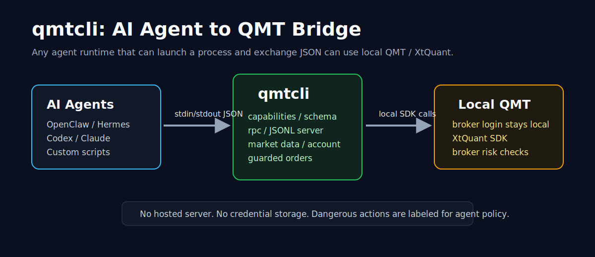

# qmtcli

[](https://github.com/2233admin/qmtcli/actions/workflows/test.yml)


AI-native local trading bridge for QMT / miniQMT.

`qmtcli` lets AI agents use a logged-in local broker QMT client through a stable JSON CLI. Agents
can discover capabilities, check the QMT/XtQuant environment, request market data, query accounts,
and submit guarded stock orders without importing broker-bundled `xtquant` directly.

中文定位：让 AI Agent 通过本地 JSON CLI 使用 QMT / XtQuant 的交易工具。



`qmtcli` does not download, vendor, log in to, or replace QMT. Install and log in to your broker's
QMT client first; broker permissions and risk checks still decide what can actually trade.

## 10-Second Demo

Agent discovery:

```powershell
qmtcli capabilities
qmtcli schema
qmtcli examples
```

One-shot JSON request:

```powershell
Get-Content examples\status.json | qmtcli rpc
```

Long-running JSONL loop for an agent runtime:

```powershell
qmtcli server
```

Every agent-facing response is JSON:

```json
{"ok":true,"data":{}}
```

Errors are JSON too:

```json
{"ok":false,"error":"message"}
```

If a request includes `id`, the response echoes it.

## Why This Exists

Most agents can run commands and exchange JSON, but QMT's `xtquant` SDK lives inside a broker
client install and is awkward to import safely from arbitrary agent runtimes. `qmtcli` gives any
local agent a narrow tool, including OpenClaw, Hermes, Codex, Claude, Cursor-style agents, and
custom schedulers:

- self-describing `capabilities`, `schema`, and `examples`;
- stdin/stdout JSON instead of Python SDK imports;
- credentials stay inside the logged-in QMT client;
- read-only calls, escape hatches, order placement, and cancel actions are labeled separately;
- tests fake `xtquant`, so CI does not need a real broker install.

## Features

- Agent-first protocol: `capabilities`, `schema`, `examples`, `rpc`, and JSONL `server`.
- QMT SDK discovery from common Windows install paths.
- `status` and `doctor` diagnostics for local `xtquant` availability.
- Market data helpers for calendar, sectors, ticks, bars, and L2 data.
- Account helpers for asset, positions, orders, and trades.
- Fixed-price A-share `buy`, `sell`, and `cancel` commands.
- Escape hatches: `data-call` for public `xtquant.xtdata` methods and `trade-call` for public
  `XtQuantTrader` methods.

## Install

For local development:

```powershell
uv sync --extra dev
uv run qmtcli status
```

Editable pip install also works:

```powershell
pip install -e .[dev]
qmtcli status
```

## Agent Usage

Discovery:

```powershell
qmtcli capabilities
qmtcli schema
qmtcli examples
```

RPC:

```powershell
Get-Content examples\status.json | qmtcli rpc
Get-Content examples\data_call.json | qmtcli rpc
```

JSONL server:

```powershell
.\examples\jsonl_server.ps1
```

Generic local-agent integration notes are in [`examples/agent_tool.md`](examples/agent_tool.md).
The README GIF script is in [`docs/demo_storyboard.md`](docs/demo_storyboard.md).

## QMT Install And Paths

`qmtcli` accepts either a QMT install root or its `userdata_mini` directory:

```powershell
qmtcli --path D:\DFZQxtqmt_client_real_win64 doctor
qmtcli --path D:\DFZQxtqmt_client_real_win64\userdata_mini --account ACCOUNT_ID asset
```

When `--path` is omitted, these roots are checked:

- `D:\DFZQxtqmt_client_real_win64`
- `D:\DFZQxtqmt_client_test_win64`
- `C:\DFZQxtqmt_client_real_win64`
- `C:\DFZQxtqmt_client_test_win64`

Expected SDK location:

```text
<QMT root>\bin.x64\Lib\site-packages\xtquant
```

## Common Commands

Diagnostics:

```powershell
qmtcli status
qmtcli doctor
python -m qmtcli status
```

Market data:

```powershell
qmtcli calendar
qmtcli sector-list
qmtcli sector-stocks 沪深A股
qmtcli full-tick 600519.SH 000001.SZ
qmtcli bars 600519.SH --period 1d --count 100
qmtcli l2-quote 600519.SH
qmtcli l2-order 600519.SH
qmtcli l2-transaction 600519.SH
```

Account and order commands require `--account`:

```powershell
qmtcli --account ACCOUNT_ID asset
qmtcli --account ACCOUNT_ID positions
qmtcli --account ACCOUNT_ID orders
qmtcli --account ACCOUNT_ID trades
qmtcli --account ACCOUNT_ID buy 600519.SH 100 1500.00
qmtcli --account ACCOUNT_ID sell 600519.SH 100 1500.00
qmtcli --account ACCOUNT_ID cancel ORDER_ID
```

## Escape Hatches

`data-call` calls any public method on `xtquant.xtdata`:

```powershell
qmtcli data-call get_stock_list_in_sector --args "[\"沪深A股\"]"
qmtcli data-call get_cb_info --args "[\"123001.SZ\"]"
```

`trade-call` calls any public method on `XtQuantTrader` after connecting the account. By default,
the `StockAccount` object is prepended to positional arguments:

```powershell
qmtcli --account ACCOUNT_ID trade-call query_stock_orders
qmtcli --account ACCOUNT_ID trade-call some_method --args "[1,2]" --kwargs "{\"flag\":true}"
qmtcli --account ACCOUNT_ID trade-call method_without_account --no-account
```

Private method names beginning with `_` are blocked.

## JSON Request Examples

```json
{"command":"status"}
{"command":"data_call","method":"get_stock_list_in_sector","args":["沪深A股"]}
{"command":"buy","account":"ACCOUNT_ID","symbol":"600519.SH","volume":100,"price":1500.0}
```

For JSONL `server`, one input line produces one output line. Request `id` is echoed.

## Safety Boundaries

- Local only: no network server is opened by `server`; it reads stdin and writes stdout.
- No broker software download or auto-install.
- No credential storage.
- No order retry loop.
- `capabilities` marks order placement and cancel actions as dangerous.
- A-share order volume must be a positive multiple of 100.
- Order price must be positive.
- Private `xtdata` / `XtQuantTrader` method names are blocked.
- QMT account permissions, risk checks, and final execution are still controlled by QMT and the broker.

## Command Help

```powershell
qmtcli --help
qmtcli capabilities --help
qmtcli schema --help
qmtcli examples --help
qmtcli data-call --help
qmtcli trade-call --help
qmtcli rpc --help
qmtcli server --help
```

## Development

```powershell
uv run --extra dev pytest -q
uv run --extra dev ruff check .
uv build
```

For coding agents, see [`AGENTS.md`](AGENTS.md) for the project map, safety boundaries, and first
commands.

PyPI packaging metadata is present so the name/build shape is reserved for future publishing, but
this project is not published by this repository workflow.
